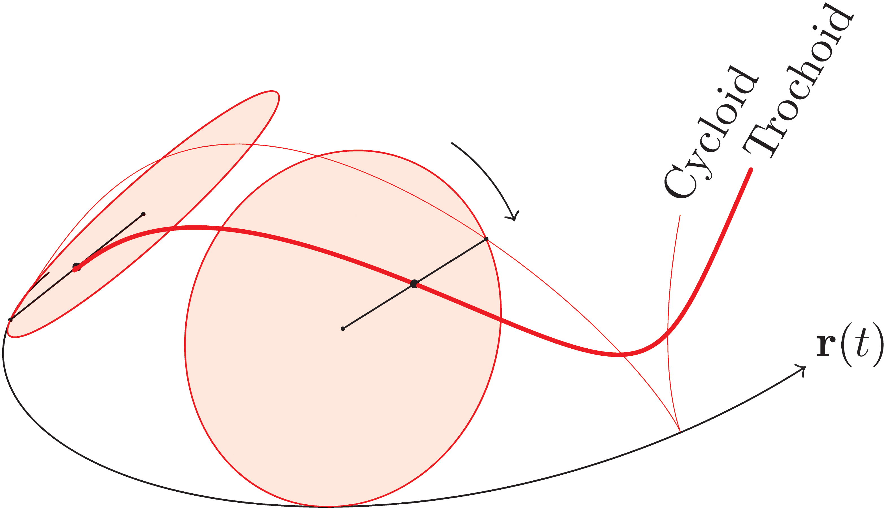
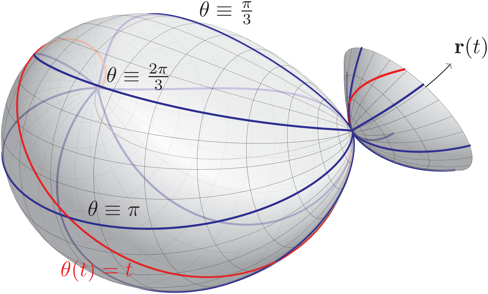
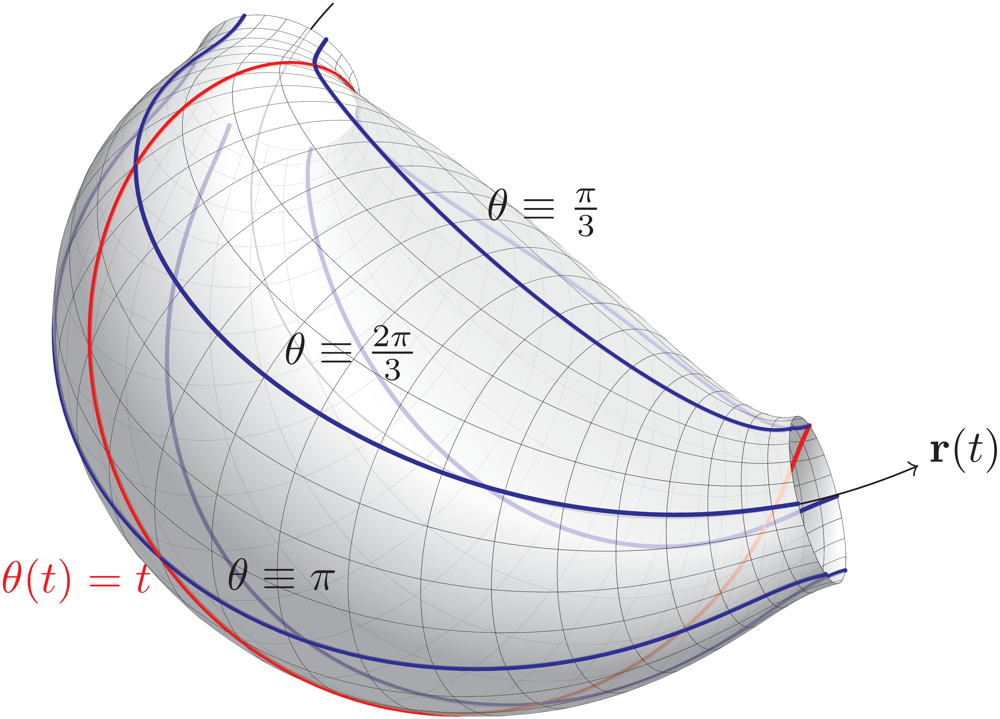
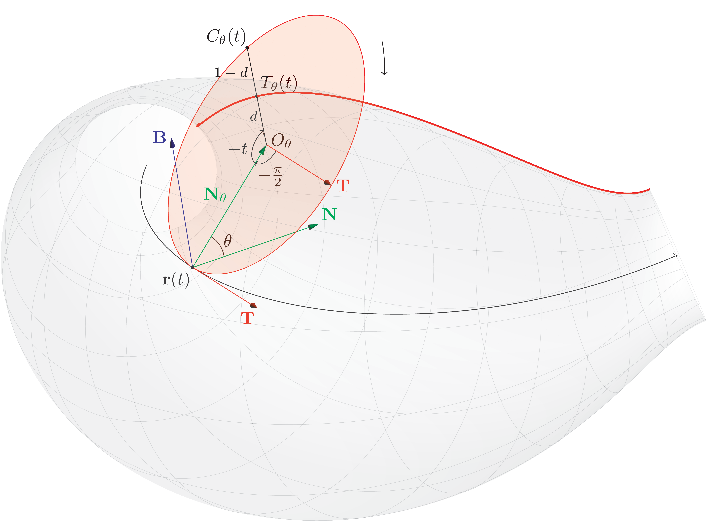
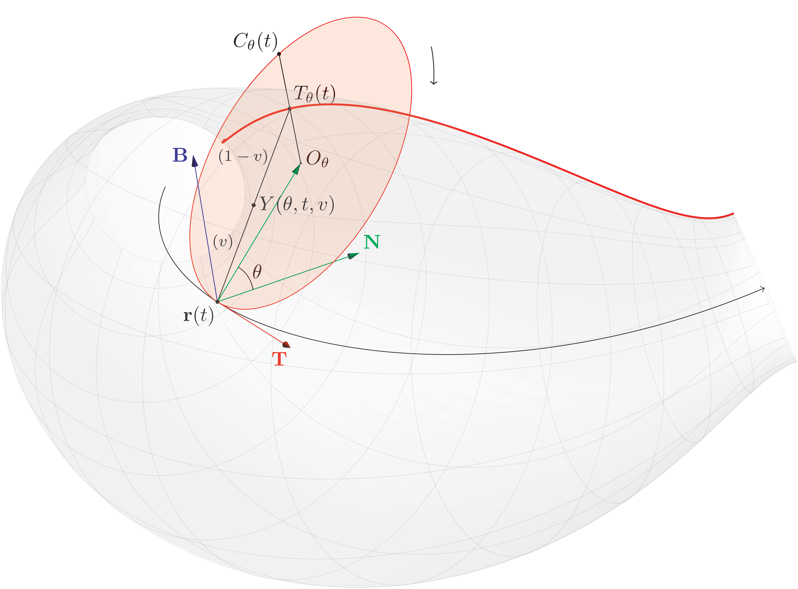

[Asymptote vector graphics language](https://asymptote.sourceforge.io/) is used to create the figures in this
repository.

## Demo
```sh
asy demo
```
will create the following figure:


## Showcases
### A cycloid and a trochoid on a curve


### Surfaces created by cycloids and trochoids




### Parametrizations




### ...And even an animation!

